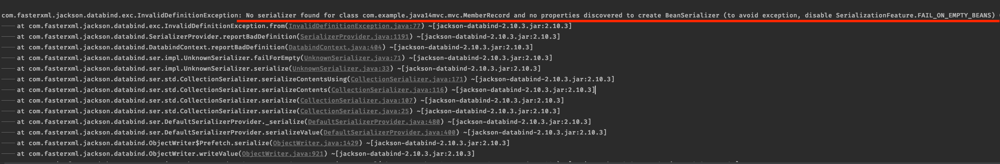
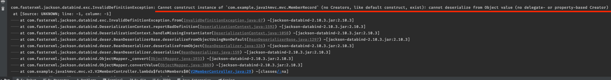
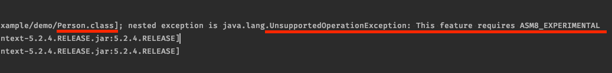

# Java 14 Preview Featur R&D

해당 프로젝트는 Java 14의 preview feature를 R&D한 프로젝트입니다.

### 들어가기에 앞서

Java 14에 추가된 feature 중 기능에 관련된 항목만을 설명합니다. (`GC`와 관련된 내용이나 `제거된 패키지`들에 대한 내용은 다루지 않습니다.)

- records (Preview)

- Switch Expressions (Standard)

- Text Blocks (Second Preview)

- - -

## Step Up: Java 14 Setting

**OpenJDK 14 설정은 IntelliJ IDEA를 기준으로 설정합니다.**

* Java 14를 사용하기 위해서는 `IntelliJ의 얼리엑세스(Early Access Program)`버전이 필요합니다.

    IntelliJ EAP 설치 (<a href="https://www.jetbrains.com/ko-kr/resources/eap/">링크</a>)

1. JDK는 OpenJDK 14버전을 필요로 합니다.

2. IntelliJ EAP 버전으로 프로젝트를 Open합니다.

3. `File → Project Structure → Project Settings → Project → Project SDK`항목의 버전을 `'OpenJDK 14'` 버전으로 설정합니다.

4. `File → Project Structure → Project Settings → Project → Project Language Level`을 
`'14 (Preview) - Records, patterns, text blocks'` 항목으로 선택합니다.

    Java 14 Preview Feature & Spring MVC 참고 (<a href="https://youtu.be/mr-7kGy8Yao">링크</a>)

- - -

## R&D 중 발견된 이슈 리스트

- records (Preview)
    
    - 컨트롤러에서 응답 객체 타입으로 record 타입을 사용할 경우 Jackson2HttpMessageConverter가 `record 객체를 JSON 형태로 시리얼라이즈하는 과정에서 에러가 발생`합니다. 
    
    
    
    **원인)**
    
    Jackson은 프로퍼티 기반으로 동작하는데, `getters를 기반`으로 프로퍼티를 얻습니다.
    
    getters 정의를 record로 전가하는 경우 `메소드 네이밍 컨벤션에 get이라는 키워드가 누락되어 프로퍼티를 얻어내는데 실패`합니다.
    
    이러한 문제는 records의 `멤버변수들에 프로퍼티 선언을 하거나(@JsonProperty) 객체의 매핑 법칙을 변경하여(@JsonAutoDetect)` 해결할 수 있으며, 
    다른 방법으로는 `메소드 네이밍에 get`이 들어가도록 getters를 직접 정의하여 문제를 우회할 수 있습니다.
    
       
    
    - ObjectMapper를 이용해 `Object to record 간 값 복사를 시도하는 경우 에러가 발생`합니다.
    
    
    
    **원인)**
    
    record는 자동으로 생성해주는 것 중 `기본 생성자를 생성하지 않습니다.` (멤버 변수가 상수이기 때문일 것으로 추측)
    
    반면 ObjectMapper는 `기본 생성자로 객체를 생성`하기 때문에 복사를 수행할 수가 없는 것으로 추측됩니다.
    
    이러한 문제는 record의 `멤버변수들에 프로퍼티 선언을 하거나(@JsonProperty) 객체의 매핑 법칙을 변경하여(@JsonAutoDetect)` 해결할 수 있습니다.
    
       

    - `Spring Boot 2.3.0.M3`버전에 정의된 자식 의존성 중 `Spring Framework 5.2.4.RELEASE` 버전을 사용할 경우 에러가 발생합니다.
    
    
    
    **원인)**
    
    *ASM 라이브러리 버전 업데이트로 인한 호환성 이슈로, `Spring Framework`의 버전을 `5.2.3.RELEASE로 패치버전을 다운그레이드`해야 records 기능을 사용할 수 있습니다. 
    
**ASM이란?**

<a href="https://www.roseindia.net/spring/spring3/spring-3-asm.shtml">ASM</a>은 자바 바이트 코드를 분석하고 다루는 라이브러리이며, 스프링 프레임워크에 포함되어 있습니다.    

- Switch Expressions (Standard)

    - 발견된 이슈 없음

- Text Blocks (Second Preview)